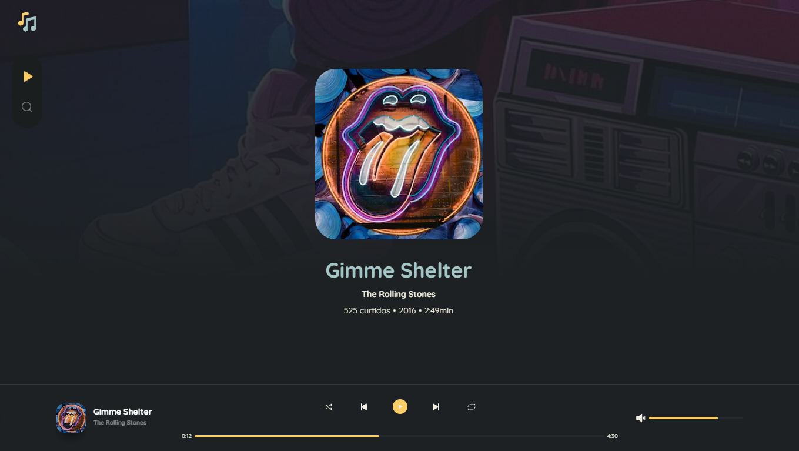

## Music App

Um app de músicas que utiliza a API do Deezer.

[](https://github.com/lucaslousada)
[](#)
[](#)
[](#)
[](LICENSE.md)

🚧 App em desenvolvimento... 🚧

<div>
  
</div>

## Tecnologias

Esse projeto foi desenvolvido com as seguintes tecnologias:

- ReactJS
- TypeScript
- Vite
- React Router Dom
- Axios
- Styled Components
- Radix UI
- Phosphor Icons
- Polished
- e outros.

<!-- ## Features

- [x] Lorem Ipsum. -->

## Executar o projeto

Você precisa instalar o [Git](https://git-scm.com/downloads) e o [Node.js](https://nodejs.org/en/download/) para executar este projeto.
Você pode usar [Yarn](https://yarnpkg.com/) ou [Npm](https://nodejs.org/en/download/).

```bash
# Clone o projeto e acesse a pasta
$ git clone https://github.com/lucaslousada/music-app.git && cd music-app
# Instale as dependências
$ yarn
# Inicie o servidor com
$ yarn dev
```

## Licença

Este projeto está licenciado sob a Licença MIT - veja o arquivo [LICENSE](LICENSE.md) para mais detalhes.
